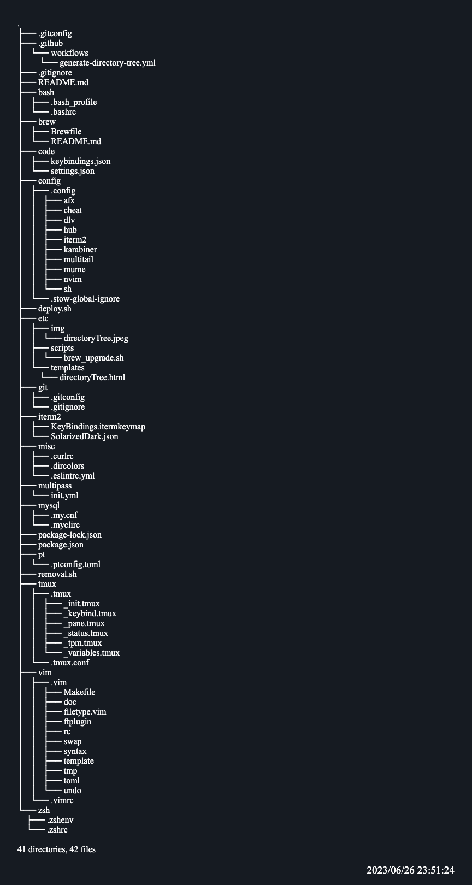

# dotfiles

## Dependence

- GNU-stow

## deploy dotfiles

```
./deploy.sh
```

**When deploying for the first time**

Symbolic links for '.gitignore' are not created due to the 'stow' specification.
To avoid this, you need to deploy '.stow-global-ignore' to your home directory first.
In conclusion, you need to run the deploy.sh twice.

## removal dotfiles

```
./removal.sh
```

### MacOS

On MacOS, run this to install various thing after installing **homebrew**.

```
cd brew
brew bundle
```

## Configuration files included

- zsh
    - afx
- neovim
    - dein.vim
- tmux
- iterm2
- brew

## Directory structure


